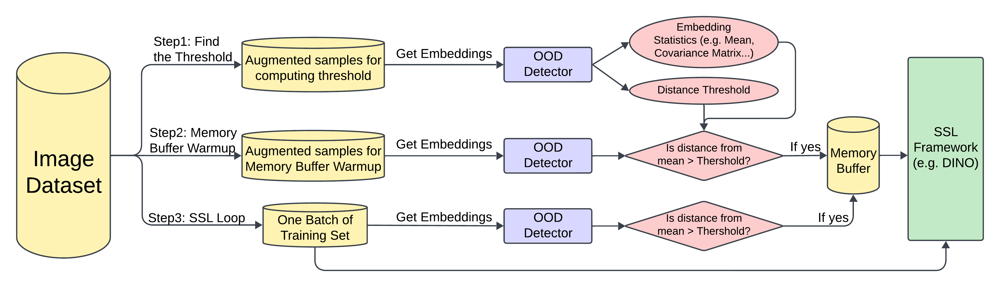

# Enhancing Visual Encoder Self-Supervised Pre-training With OOD Detector

This project presents a novel framework that integrates Out-of-Distribution (OOD) detection into self-supervised learning (SSL) pipelines, aiming to improve representation learning for rare objects in long-tailed datasets such as autonomous driving video frames. By dynamically detecting and incorporating rare samples into training using a memory buffer, the model achieves better generalization and performance on underrepresented classes.

## 🔍 Motivation

Conventional SSL models (e.g., SimCLR, DINO) perform poorly on long-tailed distributions where frequent classes dominate. In safety-critical domains like autonomous driving, underrepresenting rare objects (e.g., pedestrians, traffic signs) leads to suboptimal feature learning. This project addresses this gap by detecting rare examples using a flexible distance-based OOD detector and reintroducing them into training via a memory buffer.

## 🚀 Key Contributions

- **OOD-Enhanced SSL Pipeline**: Embedding-based OOD detection flags rare samples for prioritization.
- **Dynamic Memory Buffer**: Stores OOD-flagged samples for repeated training exposure.
- **DINO Integration**: Combines rare and regular samples during self-supervised training.
- **Empirical Evaluation**: Shows improved rare-object recognition on BDD100K and ImageNet subsets.

## 🧠 Method Overview

1. **Embedding Extraction**: A ResNet-50 encoder pretrained with DINO is used to extract features.
2. **OOD Detection**: Samples with high embedding distance from the mean are flagged as rare.
3. **Memory Buffer**: FIFO queue stores and updates rare samples throughout training.
4. **Self-Supervised Training**: Augmented batches include rare samples for DINO training.

  

## 📊 Experimental Setup

- **Datasets**: BDD100K (long-tailed driving scenes), ImageNet subset.
- **Preprocessing**: 8-crop augmentations (2 global + 6 local) per frame.
- **Buffer Size**: 32 rare crops.
- **Batch Size**: 1024
- **Training**: 100 epochs, cosine LR scheduler, AdamW optimizer (lr=5e-4)

## 📈 Results Snapshot

| Dataset     | Threshold | Precision | Recall | F1     |
|-------------|-----------|-----------|--------|--------|
| ImageNet 256 | 0.99      | 0.20      | 0.0018 | 0.0035 |
| BDD100K 256 | 0.80      | 0.1764    | 0.0190 | 0.0344 |

## 🔧 Future Improvements

- Adaptive online thresholds
- Robust scene vs. object rarity distinction
- Improved pixel-level labels for rare object crops

